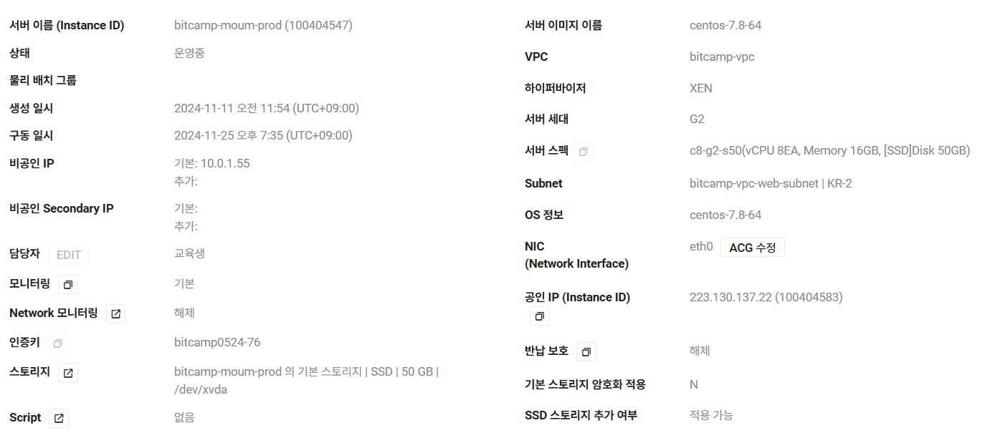

# Jenkins
## 개발서버 빌드
- Github Project : https://github.com/chocolithm/moum-dev.git/

- 오래된 빌드 삭제 : Log Rotation에 최대 100개

- 소스코드 관리
  - Repository URL : https://github.com/chocolithm/moum-dev.git
  - credential : github 아이디와 토큰 등록
  - Branches to build : */main

- Trigger : GitHub hook trigger for GITScm polling <!-- webhook으로 빌드 실행 -->

- Environment : Send files or execute commands over SSH after the build runs <!-- 대상서버에서 아래 커맨드 실행 -->
  - SSH Server : 개발서버 (moum-dev)
  - Exec Command 아래 내용 입력
  docker login -u 'chocolithm' -p '[비밀번호]' docker.io
  docker pull chocolithm/bitcamp:moum-dev
  docker ps -aq --filter name=moum | grep -q . && docker rm -f $(docker ps -aq --filter name=moum)
  docker run -d -e SPRING_PROFILES_ACTIVE=dev --name moum -p 80:80 -v /root/config:/root/config chocolithm/bitcamp:moum-dev
  <!-- application.yml은 dev로 실행 / 포트는 호스트 80번을 도커 80번으로 연결 / root/config를 가상볼륨 설정 -->

- Build Steps
  - Invoke Gradle 체크 (Task: clean build)
  - Execute shell
    docker build -t chocolithm/bitcamp:moum-dev .
    docker login -u 'chocolithm' -p '[비밀번호]' docker.io
    docker push chocolithm/bitcamp:moum-dev

## 운영서버 빌드
- Github Project : https://github.com/chocolithm/moum-prod.git/

- 오래된 빌드 삭제 : Log Rotation에 최대 100개 <!-- 빌드가 100개 쌓이면 삭제 -->

- 소스코드 관리
  - Repository URL : https://github.com/chocolithm/moum-prod.git/
  - credential : github 아이디와 토큰 등록
  - Branches to build : */main

- Environment : Send files or execute commands over SSH after the build runs <!-- 대상서버에서 아래 커맨드 실행 -->
  - SSH Server : 운영서버 1번, 2번 선택 (moum-prod1, moum-prod2)
  - Exec Command 아래 내용 입력
  docker login -u 'chocolithm' -p '[비밀번호]' docker.io
docker pull chocolithm/bitcamp:moum-prod
docker ps -aq --filter name=moum | grep -q . && docker rm -f $(docker ps -aq --filter name=moum)
docker run -d -e SPRING_PROFILES_ACTIVE=prod --name moum -p 8080:443 -v /root/config:/root/config -v /etc/letsencrypt/live/moum.bangdpool.com:/etc/letsencrypt/live/moum.bangdpool.com:ro chocolithm/bitcamp:moum-prod
  <!-- application.yml은 prod로 실행 / 포트는 호스트 8080번을 도커 443번으로 연결 /
       root/config 및 ssl 적용을 위한 letsencrypt 경로를 가상볼륨 설정 -->
  
- Build Steps
  - Invoke Gradle 체크 (Task: clean build)
  - Execute shell
    docker build -t chocolithm/bitcamp:moum-prod .
    docker login -u 'chocolithm' -p '[비밀번호]' docker.io
    docker push chocolithm/bitcamp:moum-prod

## 기타
- Publish Over SSH 플러그인 설치 필요
- 이후 Jenkins 관리 > System 하단에서 SSH-Server 등록
- admin 외에 사용자 계정 필요 시 Jenkins 관리 > Users에서 관리

# 서버

# 로드밸런서
- 리스너: 80 및 443 <!-- 80 http로 들어오는 요청도 443으로 돌리기 위해 리스너는 80/443 둘 다 설정 -->

## Target Group
- 프로토콜 및 포트: https, 443
- Sticky Session 적용
- Algorithm: Round Robin

# nginx
## moum.bangdpool.com.conf
server {
    server_name moum.bangdpool.com;

    location / {
        proxy_pass https://127.0.0.1:8080; # 8080번 포트로 전달
        proxy_set_header Host $host;
        proxy_set_header X-Real-IP $remote_addr;
        proxy_set_header X-Forwarded-For $proxy_add_x_forwarded_for;
        proxy_set_header X-Forwarded-Proto $scheme;
    }

    client_max_body_size 100M;

    # WebSocket 요청 처리
    location /ws {
        proxy_pass https://127.0.0.1:8080;
        proxy_http_version 1.1;                     # WebSocket에 필요한 HTTP 버전
        proxy_set_header Upgrade $http_upgrade;     # WebSocket 업그레이드
        proxy_set_header Connection "upgrade";      # WebSocket 연결 유지
        proxy_set_header Host $host;
        proxy_set_header X-Real-IP $remote_addr;
        proxy_set_header X-Forwarded-For $proxy_add_x_forwarded_for;
        proxy_set_header X-Forwarded-Proto $scheme;
    }

    listen 443 ssl; # managed by Certbot
    ssl_certificate /etc/letsencrypt/live/moum.bangdpool.com/fullchain.pem; # managed by Certbot
    ssl_certificate_key /etc/letsencrypt/live/moum.bangdpool.com/privkey.pem; # managed by Certbot
    include /etc/letsencrypt/options-ssl-nginx.conf; # managed by Certbot
    ssl_dhparam /etc/letsencrypt/ssl-dhparams.pem; # managed by Certbot
}

server {
    listen 80;
    server_name moum.bangdpool.com;
    #return 301 https://$host:443$request_uri; # HTTP -> HTTPS 리다이렉트

    location / {
        proxy_pass https://127.0.0.1:8080;
    }

    client_max_body_size 100M;

    # WebSocket 요청 처리
    location /ws {
        proxy_pass https://127.0.0.1:8080;
        proxy_http_version 1.1;                     # WebSocket에 필요한 HTTP 버전
        proxy_set_header Upgrade $http_upgrade;     # WebSocket 업그레이드
        proxy_set_header Connection "upgrade";      # WebSocket 연결 유지
        proxy_set_header Host $host;
        proxy_set_header X-Real-IP $remote_addr;
        proxy_set_header X-Forwarded-For $proxy_add_x_forwarded_for;
        proxy_set_header X-Forwarded-Proto $scheme;
    }
}

## wiki.moum.bangdpool.com.conf
server {
    server_name wiki.moum.bangdpool.com;

    location / {
        proxy_pass http://127.0.0.1:3000; # 3000번 포트로 전달
        proxy_set_header Host $host;
        proxy_set_header X-Real-IP $remote_addr;
        proxy_set_header X-Forwarded-For $proxy_add_x_forwarded_for;
        proxy_set_header X-Forwarded-Proto $scheme;
    }

    listen 443 ssl; # managed by Certbot
    ssl_certificate /etc/letsencrypt/live/wiki.moum.bangdpool.com/fullchain.pem; # managed by Certbot
    ssl_certificate_key /etc/letsencrypt/live/wiki.moum.bangdpool.com/privkey.pem; # managed by Certbot
    include /etc/letsencrypt/options-ssl-nginx.conf; # managed by Certbot
    ssl_dhparam /etc/letsencrypt/ssl-dhparams.pem; # managed by Certbot
}

server {
    listen 80;
    server_name wiki.moum.bangdpool.com;
    return 301 https://$host:443$request_uri; # HTTP -> HTTPS 리다이렉트
}

